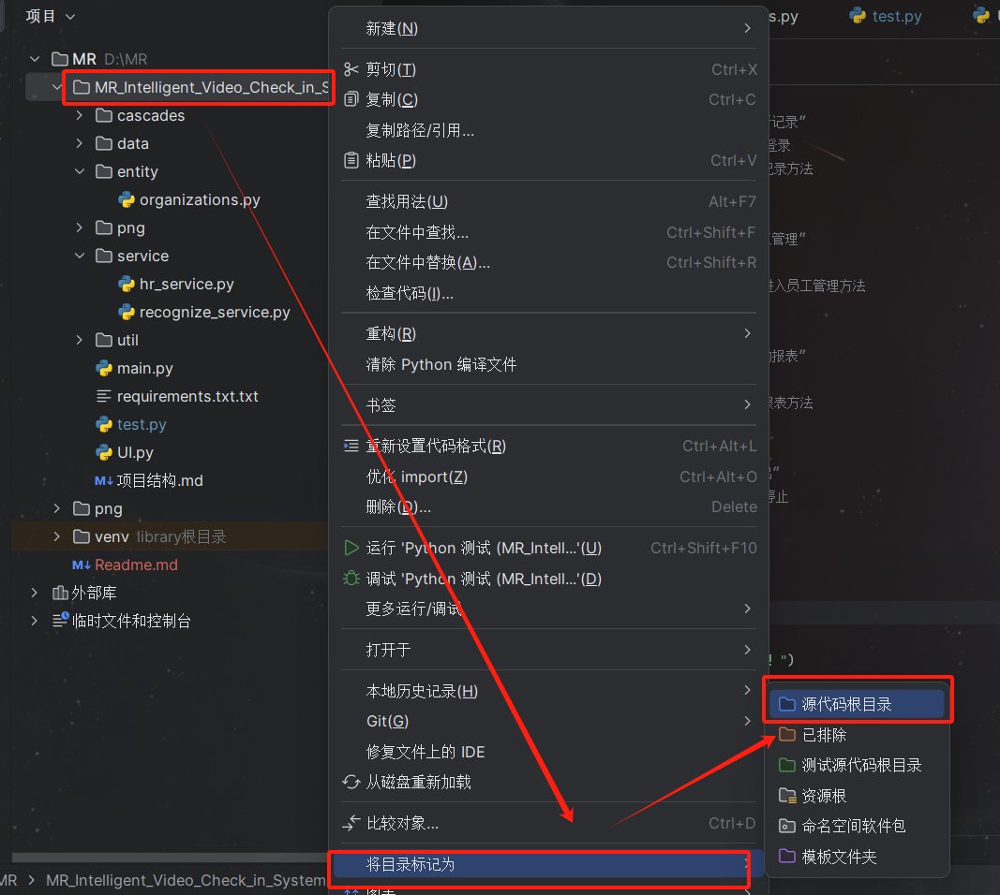
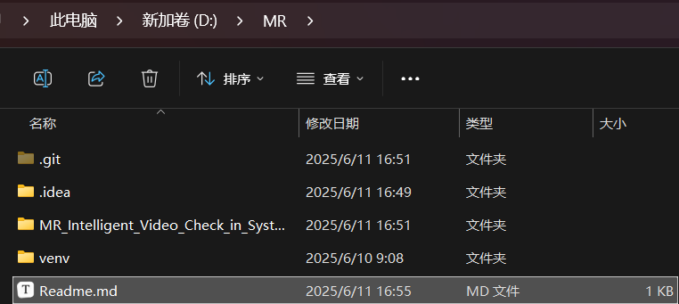
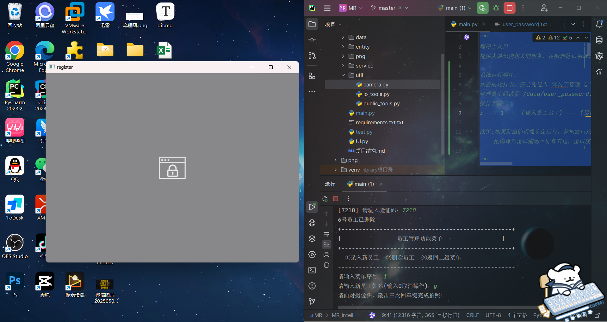

# 基于OpenCV的MR智能视频打卡系统

# (适用于南职院OpenCV期末实训)


# 项目解读

## 实训要求：在原项目基础上添加3个功能

## 注：clone仓库的路径不允许有中文，特殊字符(包括空格)

## 建议存放在英文路径下/D盘根目录

本项目由多个文件组成，除main.py 和 UI.py 为程序入口外，其他都为模块用于功能实现

说在前面的：为了确保pycharm能正确识别项目，请在pycharm中选中项目，并标记为 "源代码根目录"

​			右键项目文件夹 --- “将目录标记为” ---  "源代码根目录"



存储路径示例：(为了方便归纳理解，我将代码都放在MR..文件中)




## 项目结构

```
MR../
 ├── main.py                       # 主入口程序
 ├── test.py                       # 模拟测试脚本
 ├── UI.py                         # UI版本
 ├── 项目结构.md                    # 项目结构解释，可以直接看Readme.md
 ├── requirements.txt              # 所需依赖库
 ├── cascades/
 │   └── haarcascade_frontalface_default.xml  # OpenCV 人脸识别模型
 ├── data/
 │   ├── 2021年3月考勤月报.csv       # 考勤月报
 │   ├── employee_data.txt         # 员工信息(新录入的员工名字和特征码都在此)
 │   ├── user_password.txt         # 管理员账号密码(字典的方式存储，默认都是a)
 │   ├── work_time.txt             # 上下班时间设定(作息时间设置，请在程序中修改)
 │   ├── lock_record.txt           # 打卡记录(不可删除)
 │   └── faces/                    # 员工人脸图像数据(录入员工照片的位置)
 │   	 ├── 1000000000.png		   # 注：请勿在外部删除，请在程序中删除
 │   	 ├── 2000000000.png		   # 这俩PNG文件为必要文件不可删除
 ├── entity/
 │   └── organizations.py          # 组织结构定义
 ├── service/
 │   ├── hr_service.py             # 人事管理模块
 │   └── recognize_service.py      # 人脸识别模块
 ├── util/
 │   ├── camera.py                 # 摄像头操作工具
 │   └── public_tools.py           # 通用工具
 │   └── io_tools.py			   # 数据处理接口
```


## 使用说明(方法/教程)

确保xml文件路径正确，代码都clone完整后，让我们开始代码之旅吧！


### 1. 查看主程序 main.py

```python
"""
程序主入口
提供人脸识别相关的服务，包括训练识别器、识别图像中的人脸等。

系统运行顺序：
如需成功打卡，需要先进入 ③员工管理 层下 ①录入新员工 录入成功后，才可在首页进行打卡
管理员密码请看 /data/user_password.txt的内容 {'mr': 'mrsoft', 'a': 's'} 账号为 a,密码为 s
操作步骤：
3 --- 1 --- (输入员工名字) --- (摄像头打开后)按三次enter键 (注①)--- "录入成功" --- 3 --- 1  #打卡完成

注①:如果弹出的摄像头在后台，就把窗口点出前台，按3次回车，如果没有反应
    把编译器窗口拖动至屏幕右边，窗口放在左边，点击窗口，再点击控制台，再点击窗口(玄学点击，反正要摄像头窗口在前台)
    见下方图片
"""

# 首先第一步导包，这里使用到了 util 文件夹下的 camera 和 public_tools 并改名为tool
# 以及service 文件下的 hr_service并改名为 hr(改名都是为了方便调包时的高可读性)
from util import camera
from util import public_tools as tool
from service import hr_service as hr

# 全局变量，默认管理员没有登录，保护数据安全
ADMIN_LOGIN = False  # 管理员登录状态

# 管理员登录
'''
实现:管理员登录三次限制
超过3次限制则退出系统，可添加退出系统锁定等功能
同时，在后续系统选项中，除 "打卡" 外的所有功能都需登录管理员账号
登录后，则变为管理员身份，可以实现所有功能
 ①打卡  ②查看记录  ③员工管理  ④考勤报表  ⑤退出
 ⑥管理员密码修改
'''


def login():
    global ADMIN_LOGIN  # 用global声明全局变量(在函数中，无法调用函数外的参数，需要用global声明)
    attempt_count = 0  # 初始化尝试次数计数器

    while attempt_count < 3:  # 限制最多尝试3次
        username = input("请输入管理员账号(输入0取消操作)：")
        if username == "0":  # 如果只输入0
            return  # 结束方法
        password = input("请输入管理员密码：")
        if hr.valid_user(username.strip(), password.strip()):  # 校验账号密码
            ADMIN_LOGIN = True  # 设置为管理员已登录状态
            print(username + "登录成功！请选择重新选择功能菜单")
            return  # 登录成功，退出登录函数
        else:
            print(f"账号或密码错误，请重新输入！(还有{3 - attempt_count}次机会)")
            print("---------------------------")
            attempt_count += 1  # 尝试次数加1

    print("输入错误次数过多，已退出登录界面！")  # 超过3次尝试后提示并退出


'''
#原代码
def login():
    while True:
        username = input("请输入管理员账号(输入0取消操作)：")
        if username == "0":  # 如果只输入0
            return  # 结束方法
        passowrd = input("请输入管理员密码：")
        if hr.valid_user(username.strip(), passowrd.strip()):  # 校验账号密码
            global ADMIN_LOGIN  # 读取全局变量
            ADMIN_LOGIN = True  # 设置为管理员已登录状态
            print(username + "登录成功！请选择重新选择功能菜单")
            break
        else:
            print("账号或密码错误，请重新输入！")
            print("---------------------------")
'''

# 员工管理
'''
此功能需登录管理员账号后才能进入

录入新员工 在上方 "系统运行程序" 已详解，不赘述
删除员工: 输入员工前编号对应员工，输入随机生成的验证码( [] 中的四位数字即是验证码)，完成删除。
操作步骤： 3 --- a s(管理员账号密码)  --- 3 --- 2 --- 5(员工编号) --- 4432(随机验证码) --> 删除员工
'''


def employee_management():
    menu = """+-------------------------------------------------+
|                员工管理功能菜单                 |
+-------------------------------------------------+
  ①录入新员工  ②删除员工  ③返回上级菜单
---------------------------------------------------"""
    while True:
        print(menu)  # 打印菜单
        option = input("请输入菜单序号：")
        if option == "1":  # 如果选择“录入新员工”
            name = str(input("请输入新员工姓名(输入0取消操作)：")).strip()
            if name != "0":  # 只要输入的不是0
                code = hr.add_new_employee(name)  # 人事服务添加新员工，并获得该员工的特征码
                print("请面对摄像头，敲击三次回车键完成拍照！")
                camera.register(code)  # 打开摄像头为员工照相
                print("录入成功！")
                # return  # 退出员工管理功能菜单
        elif option == "2":  # 如果选择“删除员工”
            # show_employee_all()  # 展示员工列表
            print(hr.get_employee_report())  # 打印员工信息报表
            id = int(input("请输入要删除的员工编号(输入0取消操作)："))
            if id > 0:  # 只要输入的不是0
                if hr.check_id(id):  # 若此编号有对应员工
                    verification = tool.randomNumber(4)  # 生成随机4位验证码
                    inputVer = input("[" + str(verification) + "] 请输入验证码：")  # 让用户输入验证码
                    if str(verification) == str(inputVer).strip():  # 如果验证码正确
                        hr.remove_employee(id)  # 人事服务删除该员工
                        print(str(id) + "号员工已删除！")
                    else:  # 无效编号
                        print("验证码有误，操作取消")
                else:
                    print("无此员工，操作取消")
        elif option == "3":  # 如果选择“返回上级菜单”
            return  # 退出员工管理功能菜单
        else:
            print("输入的指令有误，请重新输入！")


# 查看记录
'''
此功能仅简单调用 hr 中的 get_employee_report() 和 get_record_all() 函数
同时在 hr 中 调用 o.EMPLOYEES ,使用organizations中的 class Employee 员工类,
并使用 tool 中的 save_employee_all() 函数,
用于打开文件 /data/employee_data.txt 或 /data/lock_record.txt (员工列表/员工打卡记录)
'''


def check_record():
    menu = """+-------------------------------------------------+
|                 查看记录功能菜单                |
+-------------------------------------------------+
  ①查看员工列表  ②查看打卡记录  ③返回上级菜单
---------------------------------------------------"""
    while True:
        print(menu)  # 打印菜单
        option = input("请输入菜单序号：")
        if option == "1":  # 如果选择“查看员工列表”
            print(hr.get_employee_report())  # 打印员工信息报表
        elif option == "2":  # 如果选择“查看打卡记录”
            report = hr.get_record_all()
            print(report)
        elif option == "3":  # 如果选择“返回上级菜单”
            return  # 退出查看记录功能菜单
        else:
            print("输入的指令有误，请重新输入！")


# 报表设置
# 这里各种调用,有注释不赘述
def report_config():
    menu = """+-------------------------------------------------+
|                报表设置功能菜单                 |
+-------------------------------------------------+
①作息时间设置  ②返回上级菜单
---------------------------------------------------"""
    while True:
        print(menu)  # 打印菜单
        option = input("请输入菜单序号：")
        if option == "1":  # 如果选择“作息时间设置”
            cont_online = 0  # 上班时间输入错误计数
            cont_offline = 0  # 下班时间输入错误计数

            # 设置上班时间
            while cont_online < 3:
                work_time = input("请设置上班时间，格式为(08:00:00)：")
                if tool.valid_time(work_time):  # 如果时间格式正确
                    break  # 结束循环
                else:  # 如果时间格式不对
                    print("上班时间格式错误，请重新输入")
                    cont_online += 1
                    if cont_online == 3:  # 如果错误次数达到3次
                        exit_option = input("输入错误次数过多，是否退出当前时间设置？(Y/N)：").strip().lower()
                        if exit_option == 'y':  # 如果用户选择退出
                            print("已退出当前时间设置")
                            return  # 退出当前时间设置
                        elif exit_option == 'n':  # 如果用户选择继续
                            cont_online = 0  # 重置尝试次数
                        else:
                            print("无效选项，继续尝试输入上班时间")

            # 设置下班时间
            while cont_offline < 3:
                close_time = input("请设置下班时间，格式为(23:59:59)：")
                if tool.valid_time(close_time):  # 如果时间格式正确
                    break
                else:  # 如果时间格式不对
                    print("下班时间格式错误，请重新输入")
                    cont_offline += 1
                    if cont_offline == 3:  # 如果错误次数达到3次
                        exit_option = input("输入错误次数过多，是否退出当前时间设置？(Y/N)：").strip().lower()
                        if exit_option == 'y':  # 如果用户选择退出
                            print("已退出当前时间设置")
                            return  # 退出当前时间设置
                        elif exit_option == 'n':  # 如果用户选择继续
                            cont_offline = 0  # 重置尝试次数
                        else:
                            print("无效选项，继续尝试输入下班时间")

            # 保存设置的时间
            hr.save_work_time(work_time, close_time)  # 保存用户设置的上班时间和下班时间
            # work_time 和 close_time是局部变量，作用域仅限于 report_config(),所以黄线警告无所谓

            print("设置完成，上班时间：" + work_time + ",下班时间为：" + close_time)
        elif option == "2":  # 如果选择“返回上级菜单”
            return  # 退出查看记录功能菜单
        else:
            print("输入的指令有误，请重新输入！")

'''
#原
def report_config():
    menu = """+-------------------------------------------------+
|                报表设置功能菜单                 |
+-------------------------------------------------+
①作息时间设置  ②返回上级菜单
---------------------------------------------------"""
    while True:
        print(menu)  # 打印菜单
        option = input("请输入菜单序号：")
        if option == "1":  # 如果选择“作息时间设置”
            cont_online = 0
            cont_offline = 0
            while cont_online < 3:
                work_time = input("请设置上班时间，格式为(08:00:00)：")
                if tool.valid_time(work_time):  # 如果时间格式正确
                    break  # 结束循环
                else:  # 如果时间格式不对
                    print("上班时间格式错误，请重新输入")
                    cont_online += 1
            print("输入错误次数过多，已退出菜单！")
            while cont_offline  < 3:
                close_time = input("请设置下班时间，格式为(23:59:59)：")
                if tool.valid_time(close_time):  # 如果时间格式正确
                    break
                else:  # 如果时间格式不对
                    print("下班时间格式错误，请重新输入")
                    cont_offline += 1
            print("输入错误次数过多，已退出菜单！")
            hr.save_work_time(work_time, close_time)  # 保存用户设置的上班时间和下班时间
            print("设置完成，上班时间：" + work_time + ",下班时间为：" + close_time)
        elif option == "2":  # 如果选择“返回上级菜单”
            return  # 退出查看记录功能菜单
        else:
            print("输入的指令有误，请重新输入！")
'''


# 考勤报表
# 同上
def check_report():
    menu = """+-------------------------------------------------+
|                考勤报表功能菜单                 |
+-------------------------------------------------+
   ①日报  ②月报  ③报表设置  ④返回上级菜单
---------------------------------------------------"""
    while True:
        print(menu)  # 打印菜单
        option = input("请输入菜单序号：")
        if option == "1":  # 如果选择“日报”
            while True:
                date = input("输入查询日期，格式为(2008-08-08),输入0则查询今天：")
                if date == "0":  # 如果只输入0
                    hr.get_today_report()  # 打印今天的日报
                    break  # 打印完之后结束循环
                elif tool.valid_date(date):  # 如果输入的日期格式有效
                    hr.get_day_report(date)  # 打印指定日期的日报
                    break  # 打印完之后结束循环
                else:  # 如果输入的日期格式无效
                    print("日期格式有误，请重新输入！")
        elif option == "2":  # 如果选择“月报”
            while True:
                date = input("输入查询月份，格式为(2008-08),输入0则查询上个月：")
                if date == "0":  # 如果只输入0
                    hr.get_pre_month_report()  # 生成上个月的月报
                    break  # 生成完毕之后结束循环
                elif tool.valid_year_month(date):  # 如果输入的月份格式有效
                    hr.get_month_report(date)  # 生成指定月份的月报
                    break  # 生成完毕之后结束循环
                else:
                    print("日期格式有误，请重新输入！")
        elif option == "3":  # 如果选择“报表设置”
            report_config()  # 进入“报表设置”菜单
        elif option == "4":  # 如果选择“返回上级菜单”
            return  # 退出查看记录功能菜单
        else:
            print("输入的指令有误，请重新输入！")


# 人脸打卡
# 调用 /data/camera 的 clock_in() 方法
def face_clock():
    print("请正面对准摄像头进行打卡")
    name = camera.clock_in()  # 开启摄像头，返回打卡员工名称
    if name is not None:  # 如果员工名称有效
        hr.add_lock_record(name)  # 保存打卡记录
        print(name + " 打卡成功！")


# 管理员密码修改
'''
用 strip()方法去除输入的多余空格，确保输入的账号和密码干净,
调用 /servers/hr 的valid_user() 方法验证用户输入的旧账号和密码是否正确
同时，在 hr 中使用 o.USERS 读取 /entity/organizations  中 当前管理员的账号密码
'''


def change_admin_password():
    print("+--------------------------------------------------+")
    print("|              管理员密码修改界面                  |")
    print("+--------------------------------------------------+")

    # 1. 输入旧账号密码
    # 使用 strip()方法去除输入的多余空格，确保输入的账号和密码干净
    old_user = input("请输入当前管理员账号：").strip()
    old_pass = input("请输入当前管理员密码：").strip()


    if not hr.valid_user(old_user, old_pass):
        print("账号或密码错误，无法修改")
        return

    # 2. 输入新账号新密码
    new_user = input("请输入新的管理员账号(只改密码请输入原账号)：").strip()
    new_pass = input("请输入新的管理员密码：").strip()
    confirm_pass = input("请再次输入新的管理员密码：").strip()

    # 3. 验证一致性
    if new_pass != confirm_pass:
        print("两次输入的新密码不一致，修改失败")
        return

    # 4. 更新管理员信息
    # if hr.update_admin(new_user, new_pass):
    if hr.update_admin(new_user, new_pass):
        print("管理员账号密码修改成功！")
    else:
        print("修改失败，请检查系统状态")


# 启动方法
'''
除 "打卡" 外的所有功能都需登录管理员账号
登录后，则变为管理员身份，可以实现所有功能
'''


def start():
    finish = False  # 程序结束标志
    menu = """
+--------------------------------------------------+
|                   主功能菜单                     |
+--------------------------------------------------+
 ①打卡  ②查看记录  ③员工管理  ④考勤报表  ⑤退出
 ⑥管理员密码修改
---------------------------------------------------"""
    while not finish:
        print(menu)  # 打印菜单
        option = input("请输入菜单序号：")
        if option == "1":  # 如果选择“打卡”
            face_clock()  # 启动人脸打卡
        elif option == "2":  # 如果选择“查看记录”
            if ADMIN_LOGIN:  # 如果管理员已登录
                check_record()  # 进入查看记录方法
            else:
                login()  # 先让管理员登录
        elif option == "3":  # 如果选择“员工管理”
            if ADMIN_LOGIN:
                employee_management()  # 进入员工管理方法
            else:
                login()
        elif option == "4":  # 如果选择“考勤报表”
            if ADMIN_LOGIN:
                check_report()  # 进入考勤报表方法
            else:
                login()
        elif option == "5":  # 如果选择“退出”
            finish = True  # 确认结束，循环停止
        elif option == "6":
            if ADMIN_LOGIN:
                change_admin_password()
            else:
                login()
        else:
            print("输入的指令有误，请重新输入！")
    print("Bye Bye !")


hr.load_emp_data()  # 数据初始化
tital = """
***************************************************
*                MR智能视频打卡系统               *
***************************************************"""
print(tital)  # 打印标题
start()  # 启动程序

```




只要理解了main.py主程序，整个项目就机会知道在做什么了，只需要把次要的 hr_service.py 稍加理解就可以

其余的文件，只需要在实现方法时，使用查找功能，进行简单理解就好


### 2,简单理解 hr_service.py

#### **员工管理**

- **添加新员工** add_new_employee()
  为新员工生成一个随机特征码，创建员工对象并保存到组织结构中，同时更新员工信息文件
- **删除员工** remove_employee() 
  删除指定员工的图片、从组织结构中移除员工，并更新员工信息和打卡记录文件。

#### **打卡记录管理**

- **获取打卡记录** (`get_record_all`):
  遍历所有员工的打卡记录，生成一个包含所有打卡时间的报表。
- **添加打卡记录** (`add_lock_record`):
  为指定员工添加当前时间的打卡记录。支持两种实现方式：
  - **基础版本**：直接将当前时间添加到打卡记录中。
  - **进阶版本**：判断打卡时间是否在上班或下班时间内，并避免重复打卡(功能未完全实现)
- **生成打卡日报** (`get_today_report`, `get_day_report`):
  根据指定日期（默认为当天），生成包含迟到、早退、缺席等信息的打卡日报。
- **生成打卡月报** (`get_pre_month_report`, `get_month_report`):
  生成指定月份的打卡月报，以CSV文件格式保存，包含每天的打卡情况（如迟到、早退、缺席等）。

#### **管理员管理**

- **验证管理员账号和密码** (`valid_user`):
  检查输入的管理员账号和密码是否匹配。
- **更新管理员账号和密码** (`update_admin`):
  更新管理员账号和密码，并将新的信息保存到文件中。

#### **报表生成**

- **员工信息报表** (`get_employee_report`):
  生成包含所有员工信息的报表，格式化输出员工名单。
- **打卡记录报表** (`get_record_all`):
  生成包含所有员工打卡记录的报表。

#### **辅助功能**

- **通过特征码获取员工姓名** (`get_name_with_code`):
  根据员工特征码查找对应的员工姓名。
- **通过ID获取员工特征码** (`get_code_with_id`):
  根据员工ID查找对应的员工特征码。
- **检查ID是否存在** (`check_id`):
  检查指定的员工ID是否存在于系统中。
- **保存上下班时间** (`save_work_time`):
  更新并保存上下班时间配置。
- **加载数据** (`load_emp_data`):
  加载管理员账号、打卡记录、员工信息、员工照片等数据。

### **2. 数据结构**

- **员工信息** (`o.EMPLOYEES`):
  存储所有员工的详细信息，包括ID、姓名、特征码等。
- **打卡记录** (`o.LOCK_RECORD`):
  存储员工的打卡记录，以字典形式保存，键为员工姓名，值为打卡时间列表。
- **管理员账号信息** (`o.USERS`):
  存储管理员账号和密码的映射关系。
- **上下班时间配置** (`o.WORK_TIME`, `o.CLOSING_TIME`):
  存储系统中设置的上班时间和下班时间。

### **3. 文件操作**

- **保存员工信息** (`io.save_employee_all`):
  将员工信息保存到文件中。
- **保存打卡记录** (`io.save_lock_record`):
  将打卡记录保存到文件中。
- **保存管理员账号** (`io.save_users`):
  将管理员账号和密码保存到文件中。
- **保存上下班时间配置** (`io.save_work_time_config`):
  将上下班时间保存到文件中。
- **生成CSV文件** (`io.create_CSV`):
  将打卡月报以CSV格式保存到文件中。

### **4. 功能流程**

1. **系统启动时加载数据** (`load_emp_data`):
   系统启动时，加载管理员账号、打卡记录、员工信息等数据。
2. **员工管理**:
   - 添加新员工时，生成随机特征码并保存信息。
   - 删除员工时，清除相关数据并更新文件。
3. **打卡管理**:
   - 员工打卡时，根据时间判断是上班打卡还是下班打卡，并记录当前时间。
   - 生成打卡日报和月报，统计迟到、早退、缺席等情况。
4. **管理员管理**:
   - 验证管理员账号和密码。
   - 更新管理员账号和密码。
5. **报表生成**:
   - 生成员工信息报表和打卡记录报表。
   - 生成打卡日报和月报，以文本或CSV格式输出。

```python
"""
重要！
人事管理服务
提供人事管理相关的服务，包括员工管理、打卡记录管理、报表生成等。

在 main 和 UI 中添加方法的同时，也需要在本文件中添加对应的方法
"""

from entity import organizations as o
from util import public_tools as tool
from util import io_tools as io
import datetime
import calendar


# 添加新员工
def add_new_employee(name):
    code = tool.randomCode()  # 生成随机特征码
    newEmp = o.Employee(o.get_new_id(), name, code)  # 创建员工对象
    o.add(newEmp)  # 组织结构中添加新员工
    io.save_employee_all()  # 保存最新的员工信息
    return code  # 新员工的特征码


# 删除某个员工
def remove_employee(id):
    io.remove_pics(id)  # 删除该员工所有图片
    o.remove(id)  # 从组织结构中删除
    io.save_employee_all()  # 保存最新的员工信息
    io.save_lock_record()  # 保存最新的打卡记录


# 所有员工信息报表
def get_employee_report():
    # report = list()   # 员工信息列表
    report = "###########################################\n"
    report += "员工名单如下：\n"
    i = 0  # 换行计数器
    for emp in o.EMPLOYEES:  # 遍历所有员工
        report += "(" + str(emp.id) + ")" + emp.name + "\t"
        i += 1  # 计数器自增
        if i == 4:  # 每四个员工换一行
            report += "\n"
            i = 0  # 计数器归零
    report = report.strip()  # 清除报表结尾可能出现的换行符
    report += "\n###########################################"
    return report


# 通过特征码获取员工姓名
def get_name_with_code(code):
    for emp in o.EMPLOYEES:
        if str(code) == str(emp.code):
            return emp.name


# 通过id获取员工特征码
def get_code_with_id(id):
    for emp in o.EMPLOYEES:
        if str(id) == str(emp.id):
            return emp.code


# 获取所有员工的打卡记录信息
def get_record_all():
    record = o.LOCK_RECORD  # 获得打卡记录字典
    report = ""  # 报表内容
    for name in record.keys():  # 遍历所有名字
        report += "-----------------------------------\n"
        report += name + "  打卡记录如下：\n"
        for date in record[name]:  # 遍历所有时间字符串
            report += date + "\n"
    return report


# 为指定员工添加打卡记录
# 列表法

def add_lock_record(name):
    record = o.LOCK_RECORD  # 所有打卡记录
    now_time = datetime.datetime.now().strftime("%Y-%m-%d %H:%M:%S")  # 当前时间
    if name in record.keys():  # 如果这个人有打卡记录
        r_list = record[name]  # 去除他的记录
        if len(r_list) == 0:  # 如果记录为空
            r_list = list()  # 创建新列表
        r_list.append(now_time)  # 记录当前时间
    else:  # 如果这个人从未打过卡
        r_list = list()  # 创建新列表
        r_list.append(now_time)  # 记录当前时间
        record[name] = r_list  # 将记录保存在字典中
    io.save_lock_record()  # 保存所有打卡记录

#打卡进阶功能(未实现)
'''
def add_lock_record(name):
    record = o.LOCK_RECORD  # 所有打卡记录
    now = datetime.datetime.now()
    now_str = now.strftime("%Y-%m-%d %H:%M:%S")  # 当前时间完整字符串
    today_str = now.strftime("%Y-%m-%d")         # 当前日期
    now_time = now.time()

    # 上下班时间
    work_time = datetime.datetime.strptime(o.WORK_TIME, "%H:%M:%S").time()
    close_time = datetime.datetime.strptime(o.CLOSE_TIME, "%H:%M:%S").time()

    # 获取该员工的历史打卡记录
    if name not in record:
        record[name] = []

    today_clock_list = [t for t in record[name] if today_str in t]  # 只取今天的记录

    # 判断今天是否已打上班卡或下班卡
    has_on = False
    has_off = False
    for t in today_clock_list:
        time_obj = datetime.datetime.strptime(t, "%Y-%m-%d %H:%M:%S").time()
        if time_obj <= datetime.time(12, 0):
            has_on = True
        else:
            has_off = True

    # 根据时间判断是否记录上班或下班打卡
    if now_time <= datetime.time(12, 0):
        if not has_on:
            record[name].append(now_str)
        else:
            print(f"{name} 今天已打过上班卡")
    else:
        if not has_off:
            record[name].append(now_str)
        else:
            print(f"{name} 今天已打过下班卡")

    io.save_lock_record()  # 保存所有打卡记录
'''

# 验证管理员账号和密码
def valid_user(username, password):
    if username in o.USERS.keys():  # 如果有这个账号
        if o.USERS.get(username) == password:  # 如果账号和密码匹配
            return True  # 验证成功
    return False  # 验证失败

# 管理员密码修改
def update_admin(new_user, new_password):
    # 读取当前管理员账号和密码
    users = o.USERS
    users[new_user] = new_password  # 更新管理员账号和密码
    # 将新的管理员账号和密码写入文件
    with open(io.USER_PASSWORD, "w", encoding="utf-8") as file:
        file.write(str(users))  # 将字典转换为字符串并写入文件
    return True


# 打印今天的打卡日报
def get_today_report():
    date = datetime.datetime.now().strftime("%Y-%m-%d")  # 今天的日期
    get_day_report(str(date))  # 打印今天的日报


# 打印指定日期的打卡日报
def get_day_report(date):
    io.load_work_time_config()  # 读取上下班时间

    earliest_time = datetime.datetime.strptime(date + " 00:00:00", "%Y-%m-%d %H:%M:%S")  # 今天0点
    noon_time = datetime.datetime.strptime(date + " 12:00:00", "%Y-%m-%d %H:%M:%S")  # 今天中午12点
    latest_time = datetime.datetime.strptime(date + " 23:59:59", "%Y-%m-%d %H:%M:%S")  # 今晚0点之前
    work_time = datetime.datetime.strptime(date + " " + o.WORK_TIME, "%Y-%m-%d %H:%M:%S")  # 上班时间
    closing_time = datetime.datetime.strptime(date + " " + o.CLOSING_TIME, "%Y-%m-%d %H:%M:%S")  # 下班时间

    late_list = []  # 迟到名单
    left_early = []  # 早退名单
    absent_list = []  # 缺席名单

    for emp in o.EMPLOYEES:  # 遍历所有员工
        if emp.name in o.LOCK_RECORD.keys():  # 如果该员工有打卡记录
            emp_lock_list = o.LOCK_RECORD.get(emp.name)  # 获取该员工所有的打卡记录
            is_absent = True  # 缺席状态
            for lock_time_str in emp_lock_list:  # 遍历所有打卡记录
                lock_time = datetime.datetime.strptime(lock_time_str, "%Y-%m-%d %H:%M:%S")  # 打卡记录转为日期格式
                if earliest_time < lock_time < latest_time:  # 如果当天有打卡记录
                    is_absent = False  # 不缺席
                    if work_time < lock_time <= noon_time:  # 上班时间后、中午之前打卡
                        late_list.append(emp.name)  # 加入迟到名单
                    if noon_time < lock_time < closing_time:  # 中午之后、下班之前打卡
                        left_early.append(emp.name)  # 加入早退名单
            if is_absent:  # 如果仍然是缺席状态
                absent_list.append(emp.name)  # 加入缺席名单
        else:  # 该员工没有打卡记录
            absent_list.append(emp.name)  # 加入缺席名单

    emp_count = len(o.EMPLOYEES)  # 员工总人数
    print("--------" + date + "--------")
    print("应到人数：" + str(emp_count))
    print("缺席人数：" + str(len(absent_list)))
    absent_name = ""  # 缺席名单
    if len(absent_list) == 0:  # 如果没有缺席的
        absent_name = "(空)"
    else:  # 有缺席的
        for name in absent_list:  # 遍历缺席列表
            absent_name += name + " "  # 拼接名字
    print("缺席名单：" + absent_name)
    print("迟到人数：" + str(len(late_list)))
    late_name = ""  # 迟到名单
    if len(late_list) == 0:  # 如果没有迟到的
        late_name = "(空)"
    else:  # 有迟到的
        for name in late_list:  # 遍历迟到列表
            late_name += name + " "  # 拼接名字
    print("迟到名单：" + str(late_name))
    print("早退人数：" + str(len(left_early)))
    early_name = ""  # 早退名单
    if len(left_early) == 0:  # 如果没有早退的
        early_name = "(空)"
    else:  # 有早退的
        for name in left_early:  # 遍历早退列表
            early_name += name + " "  # 拼接名字
    print("早退名单：" + early_name)


def is_within_time_range(start_time, end_time, current_time):
    # 将时间字符串转换为datetime对象
    start = datetime.strptime(start_time, "%H:%M:%S")
    end = datetime.strptime(end_time, "%H:%M:%S")
    now = datetime.strptime(current_time, "%H:%M:%S")
    return start <= now <= end
# 创建上个月打卡记录月报
def get_pre_month_report():
    today = datetime.date.today()  # 得到今天的日期
    pre_month_first_day = datetime.date(today.year, today.month - 1, 1)  # 获得上个月的第一天的日期
    pre_month = pre_month_first_day.strftime("%Y-%m")  # 转成年月格式字符串
    get_month_report(pre_month)  # 生成上个月的月报


# 创建指定月份的打卡记录月报
def get_month_report(month):
    io.load_work_time_config()  # 读取上下班时间
    date = datetime.datetime.strptime(month, "%Y-%m")  # 月份转为时间对象
    monthRange = calendar.monthrange(date.year, date.month)[1]  # 该月最后一天的天数
    month_first_day = datetime.date(date.year, date.month, 1)  # 该月的第一天
    month_last_day = datetime.date(date.year, date.month, monthRange)  # 该月的最后一天

    clock_in = "I"  # 正常上班打卡标志
    clock_out = "O"  # 正常下班打卡标志
    late = "L"  # 迟到标志
    left_early = "E"  # 早退标志
    absent = "A"  # 缺席标志

    lock_report = dict()  # 键为员工名，值为员工打卡情况列表

    for emp in o.EMPLOYEES:
        emp_lock_data = []  # 员工打卡情况列表
        if emp.name in o.LOCK_RECORD.keys():  # 如果员工有打卡记录
            emp_lock_list = o.LOCK_RECORD.get(emp.name)  # 从打卡记录中获取该员工的记录
            index_day = month_first_day  # 遍历日期，从该月第一天开始
            while index_day <= month_last_day:
                is_absent = True  # 缺席状态
                earliest_time = datetime.datetime.strptime(str(index_day) + " 00:00:00", "%Y-%m-%d %H:%M:%S")  # 当天0点
                noon_time = datetime.datetime.strptime(str(index_day) + " 12:00:00", "%Y-%m-%d %H:%M:%S")  # 当天中午12点
                latest_time = datetime.datetime.strptime(str(index_day) + " 23:59:59", "%Y-%m-%d %H:%M:%S")  # 当天0点之前
                work_time = datetime.datetime.strptime(str(index_day) + " " + o.WORK_TIME,
                                                       "%Y-%m-%d %H:%M:%S")  # 当天上班时间
                closing_time = datetime.datetime.strptime(str(index_day) + " "
                                                          + o.CLOSING_TIME, "%Y-%m-%d %H:%M:%S")  # 当天下班时间
                emp_today_data = ""  # 员工打卡标记汇总

                for lock_time_str in emp_lock_list:  # 遍历所有打卡记录
                    lock_time = datetime.datetime.strptime(lock_time_str, "%Y-%m-%d %H:%M:%S")  # 打卡记录转为日期格式
                    if earliest_time < lock_time < latest_time:  # 如果当前日期有打卡记录
                        is_absent = False  # 不缺席
                        if lock_time <= work_time:  # 上班时间前打卡
                            emp_today_data += clock_in  # 追加正常上班打卡标志
                        elif lock_time >= closing_time:  # 下班时间后打卡
                            emp_today_data += clock_out  # 追加正常下班打卡标志
                        elif work_time < lock_time <= noon_time:  # 上班时间后、中午之前打卡
                            emp_today_data += late  # 追加迟到标志
                        elif noon_time < lock_time < closing_time:  # 中午之后、下班之前打卡
                            emp_today_data += left_early  # 追加早退标志
                if is_absent:  # 如果缺席
                    emp_today_data = absent  # 直接赋予缺席标志
                emp_lock_data.append(emp_today_data)  # 员工打卡标记添加到打卡情况列表中
                index_day = index_day + datetime.timedelta(days=1)  # 遍历天数递增
        else:  # 没有打卡记录的员工
            index_day = month_first_day  # 从该月第一天开始
            while index_day <= month_last_day:  # 遍历整月
                emp_lock_data.append(absent)  # 每天都缺席
                index_day = index_day + datetime.timedelta(days=1)  # 日期递增
        lock_report[emp.name] = emp_lock_data  # 将打卡情况列表保存到该员工之下

    report = "\"姓名/日期\""  # cvs文件的文本内容，第一行第一列
    index_day = month_first_day  # 从该月第一天开始
    while index_day <= month_last_day:  # 遍历整月
        report += ",\"" + str(index_day) + "\""  # 添加每一天的日期
        index_day = index_day + datetime.timedelta(days=1)  # 日期递增
    report += "\n"

    for emp in lock_report.keys():  # 遍历报表中的所有员工
        report += "\"" + emp + "\""  # 第一列为员工名
        data_list = lock_report.get(emp)  # 取出员工的打卡情况列表
        for data in data_list:  # 取出每一天的打卡情况
            text = ""  # CSV中显示的内容
            if absent == data:  # 如果是缺席
                text = "【缺席】"
            elif clock_in in data and clock_out in data:  # 如果是全勤，不考虑迟到和早退
                text = ""  # 显示空白
            else:  # 如果不是全勤
                if late in data and clock_in not in data:  # 有迟到记录且无上班打卡
                    text += "【迟到】"
                if left_early in data and clock_out not in data:  # 有早退记录且无下班打卡
                    text += "【早退】"
                if clock_out not in data and left_early not in data:  # 无下班打卡和早退记录
                    text += "【下班未打卡】"
                if clock_in not in data and late not in data:  # 有无上班打卡和迟到记录
                    text += "【上班未打卡】"
            report += ",\"" + text + "\""
        report += "\n"

    title_date = month_first_day.strftime("%Y{y}%m{m}").format(y="年", m="月")  # csv文件标题日期
    file_name = title_date + "考勤月报"  # CSV的文件名
    io.create_CSV(file_name, report)  # 生成csv文件


# 检查id是否存在
def check_id(id):
    for emp in o.EMPLOYEES:
        if str(id) == str(emp.id):
            return True
    return False


# 保存上下班时间
def save_work_time(work_time, close_time):
    o.WORK_TIME = work_time
    o.CLOSING_TIME = close_time
    io.save_work_time_config()  # 上下班时间保存到文件中


# 加载数据
def load_emp_data():
    io.checking_data_files()  # 文件自检
    io.load_users()  # 载入管理员账号
    io.load_lock_record()  # 载入打卡记录
    io.load_employee_info()  # 载入员工信息
    io.load_employee_pic()  # 载入员工照片


```


1. - 


